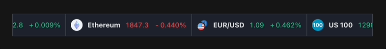

# Overview
As a member of the Valstro UI Engineering team, you'll be building a multi-window desktop application with complex UI features. Therefore, the purpose of this assessment is to show that you have the fundamentals for building fast reactive UI applications, with modern day best practices.

# Setup

1. Clone & cd into the repo
2. `npm i` to install deps
3. `npm run start:dev` to start the client app & server
4. Head over to `http://localhost:3000/`

## Goal

Create a smooth & infinitely scrolling instrument reel, using the WebSocket server running on `ws://localhost:3000/ws`.

### Solution:

See: [./full-solution.mp4](./full-solution.mp4) for a more detailed solution video.

## Instructions

Start in the `src/client/edit-me` directory. Here you'll find three files for you to edit to build your widget.

### Dos

- Connect & display real-time information from the WebSocket Server on `ws://localhost:3000/ws`.
- For each instrument in the real, show an icon (see `/public` folder for all assets), name, last quote and percentage change (since last quote).
- Create a smooth scrolling effect that infinitely loops.
- The scrolling effect must pause when the user hovers over the reel and resume when not.
- Style your widget to look similar to the image above. Don't worry about it looking exactly the same, so long as it looks good/clean.
- Feel free to create new files (if you want), just don't edit files or lines where explicitly stated in the comments.

### Don'ts

- Do not install any dependencies, however, you may import from other local files & folders (ex. `src/common-leave-me`).
- Do not edit files or lines of code where explicitly stated in the comments.

## Time

You have 7 days to complete this challenge, however, the challenge has been setup to take between 3 & 4 hours. If you are uncomfortable with 3, 4 or more hours on a challenge please just tell us how many hours you spent before stopping.

---

Good luck!
